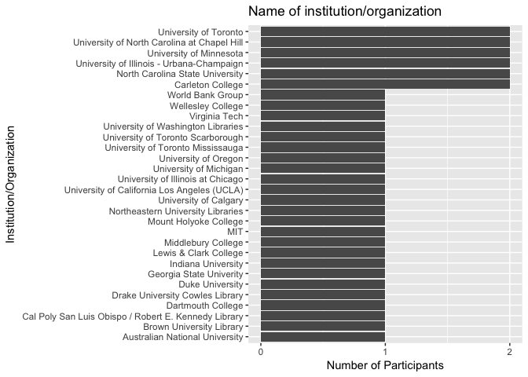
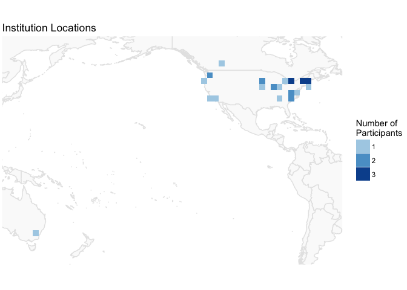
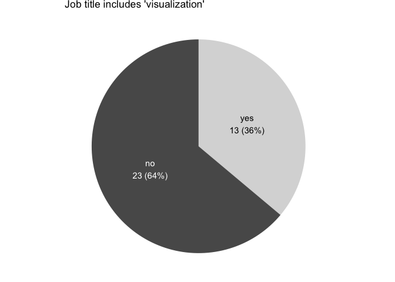
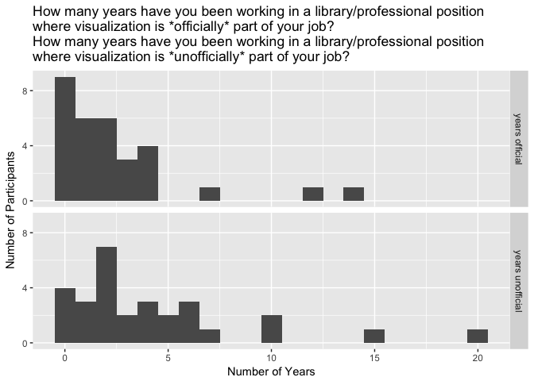
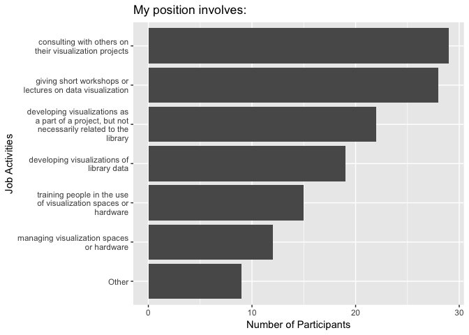
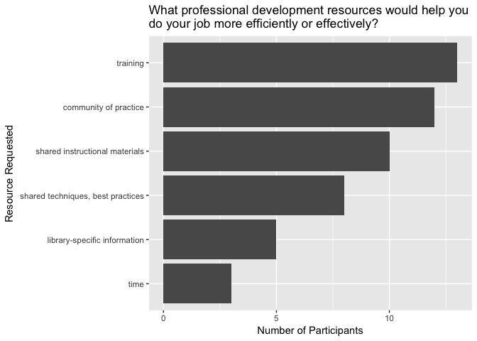
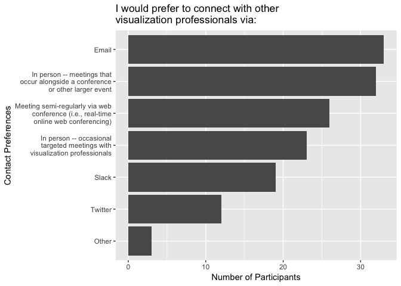
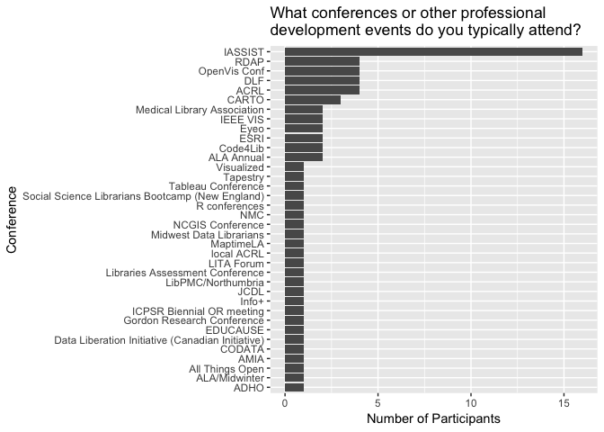

Six years ago, almost to the day, I joined Duke University Libraries as
their first Data Visualization Coordinator. At the time, it was unusual
for libraries to be able to offer targeted support for data
visualization, especially with a dedicated, full-time position. In the
past six years, though, I’ve seen a huge rise in the number and variety
of visualization-related positions at libraries. It’s been a dream of
mine to build a more intentional community around data visualization in
libraries.

In the late spring of 2017, I decided to send around a simple Google
form to see how many people in the library/information professional
community identify as “visualization” people. While we know that
visualization services and visualization work in libraries, writ
broadly, are on the rise, it’s hard to know how many people are really
working in this space and what they are doing (or struggling to do). I
advertised the Google form both to the [IASSIST](http://www.iassistdata.org/) listserv and directly to
individuals I suspected might be interested in completing the form
because of their focus on visualization.

I got 36 responses to the form, including information professionals from
30 separate institutions. The results suggest an active and growing
library visualization community that is ready to be in more regular
contact\!

## Institutions Represented

First, to summarize the participants, I’ll share the institutions
represented. We had participants from 30 different institutions,
including several outside of the U.S.

<!-- -->

<!-- -->

## Job Titles

I asked participants to share their job titles, partly to see how many
institutions were explicitly including the word “visualization” in job
titles. Thirty-six per cent of the participants had job titles that
explicitly included the word “visualization.”

<!-- -->

## Years in the Field

I suspected that while “visualization” may only recently have begun
appearing in formal job descriptions, it may have been an informal part
of library work for some time. Indeed, several participants have been
unofficially tasked with visualization work for some time, though even
official visualization work has been going on for many years.

<!-- -->

## Job Activities

To understand a bit more about the job activities of individuals doing
data visualization work in libraries, I asked about some specific
activities that seemed likely components of visualization work. Three
types of activities – consulting, short workshops, and non-library
visualization projects – show up in the work of over half of the
participants.

<!-- -->

## Resources needed

I believe the best way to build a community of practice is to use it to
advance our work in ways we have been unable to accomplish on our own. I
asked participants the types of resources they could use, and aside from
direct mentions of a community of practice, participants look most for
training, followed by shared instructional materials and shared
techniques or best practices.

<!-- -->

## Contact Preferences

To form a community of practice and to share resources requires some
method for contacting each other. The contact preferences showed that
email may still be our best choice, followed by in-person meetings at
conferences.

<!-- -->

## Conferences

To follow-up on the idea of meeting in-person at conferences, I asked
about the conferences typically attended by visualization specialists.
There is a skew toward IASSIST – unsuprising, given that I advertised to
that group – but unfortunately there doesn’t seem to be a sweeping
conference that everyone attends.

<!-- -->

## Next Steps

I’m happy to be able to share these results (finally), but I know that
the next steps will have to come from the group. Maybe we can start
building up from good models, like the NC Data Interest Group (NCDIG).
Earlier this month I taught my third year at NCSU’s [Data Science and
Visualization Institute for Librarians](https://www.lib.ncsu.edu/data-science-and-visualization-institute), which means we have three
cohorts of librarians building data and visualization skills who may
also be looking for a community.

Full disclosure: I’ve been working for some time with Justin Joque
(University of Michigan) and Andy Rutkowski (University of Southern
California) on similar issues, and as we mentioned in a presentation at
IASSIST this year, we’re excited and hopeful about a grant proposal
we’ve been working on that would really catalyze this kind of
community building. Rather than waiting to see if that materializes,
though, I’d love to know what we could do now\! Please do send me any
ideas you have (angela \[dot\] zoss \[at\] duke \[dot\] edu), or if you
have suggestions for a place where we could start having discussions,
I’d love to hear about it\!

*Editor's note:
NC Data Interest Group (NCDIG) is an informal group of librarians and library staff for whom data is a part of their position or have an interest (e.g., data management, data visualization, data analysis and computation, institutional repositories, GIS/mapping data, data literacy, and/or programming/coding) across all subjects/disciplines and across North Carolina.  NCDIG will provide an online discussion forum to support members across a wide range of roles with data and to foster opportunities to interact more regularly to support collective learning - sharing advice, best practices, collaborative problem-solving, announce training opportunities and events, and build relationships.*

*To sign up for the NC Data Interest Group (NCDIG) Google group, please [visit this page](https://groups.google.com/forum/#!forum/ncdig).*
